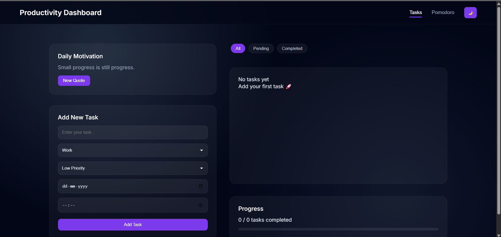
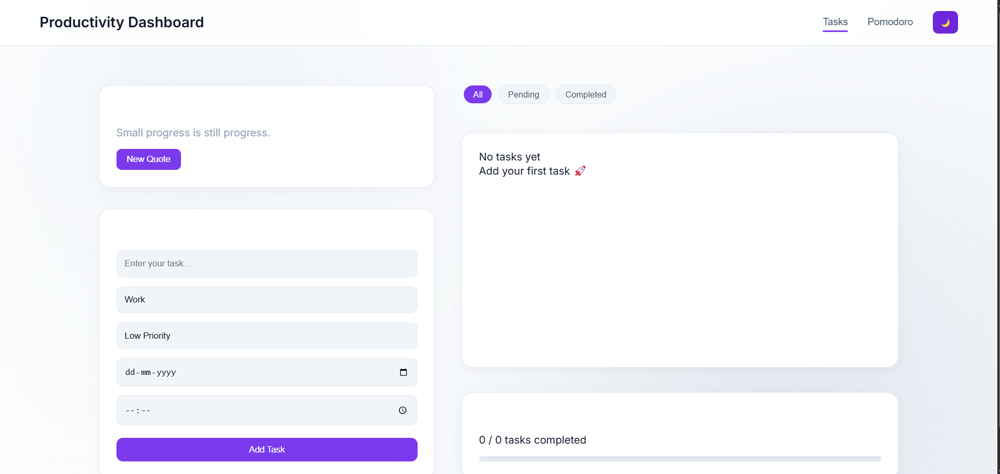
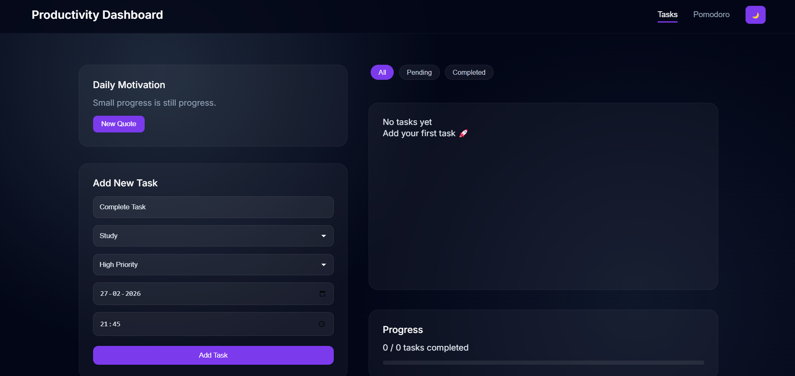
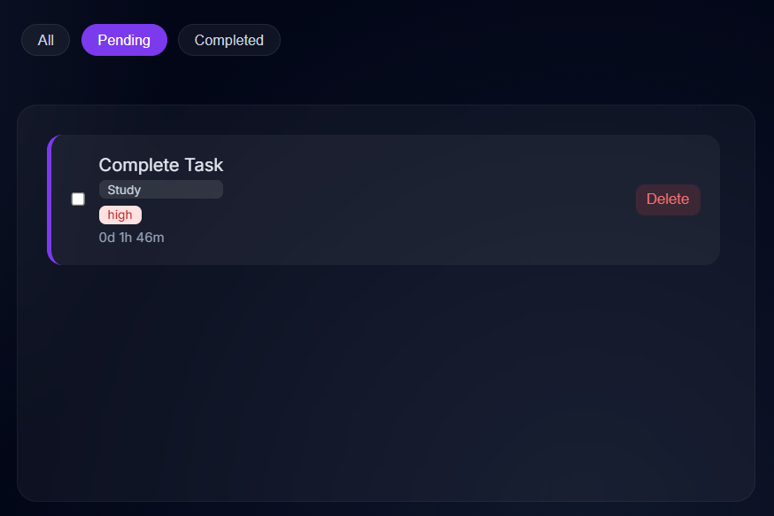
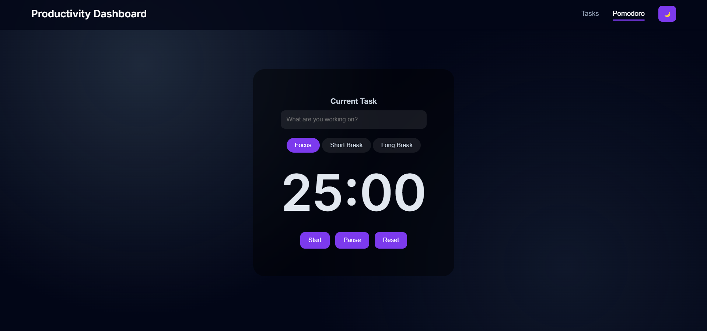

# Personal Productivity Dashboard

A modern **Personal Productivity Dashboard** built using **HTML, CSS, and JavaScript** to help users manage tasks, stay organized, and improve productivity.

This web application allows users to manage tasks, track deadlines, stay motivated with quotes, and maintain focus using a Pomodoro timer.

---

## Live Demo

🔗 https://mohdhuzaifaa.github.io/productivity-dashboard/

---

## GitHub Repository

🔗 https://github.com/MohdHuzaifaa/productivity-dashboard

---

# Features

## Task Management

Users can manage daily tasks easily.

Features include:

- Add new tasks
- Delete tasks
- Mark tasks as completed
- Categorize tasks (Work, Study, Personal)
- Set priority levels (High, Medium, Low)

---

## Task Filtering

Users can filter tasks based on their status.

Available filters:

- All Tasks
- Pending Tasks
- Completed Tasks

---

## Deadline Countdown

Tasks support deadlines with **date and time**.

The application shows the **remaining time** until the deadline.

---

## Progress Tracking

A progress bar displays the number of tasks completed compared to the total tasks.

This helps users track productivity.

---

## Dark Mode and Light Mode

Users can switch between:

- Dark theme
- Light theme

for a better user experience.

---

## Motivational Quotes

The dashboard displays motivational quotes to keep users inspired and productive.

---

## Pomodoro Timer

The application includes a Pomodoro timer to help users maintain focus while working.

Features include:

- Focus timer (25 minutes)
- Short break
- Long break
- Start button
- Pause button
- Reset button
- Task name input for focus session

---
# Key Functionalities

The dashboard provides several productivity tools:

- Task creation with category and priority
- Task completion tracking
- Deadline countdown timer
- Task filtering system
- Motivational quotes display
- Pomodoro focus timer
- Dark and Light theme switch
- Progress tracking with visual progress bar

# Technologies Used

This project is built using:

- HTML5
- CSS3
- JavaScript (Vanilla JS)
- LocalStorage API
- GitHub Pages for deployment

---

# Project Structure
productivity-dashboard
│
├── css
│ └── style.css
│
├── js
│ ├── app.js
│ ├── taskManager.js
│ ├── storage.js
│ ├── filter.js
│ ├── progress.js
│ ├── deadline.js
│ ├── theme.js
│ ├── quote.js
│ └── pomodoro.js
│
├── screenshots
│ ├── dashboard-dark.png
│ ├── dashboard-light.png
│ ├── add-task.png
│ ├── task-filter.png
│ └── pomodoro.png
│
├── index.html
└── README.md

---

# Screenshots

## Dashboard (Dark Mode)

---

## Dashboard (Light Mode)

---

## Add Task Feature

---

## Task Filtering

---

## Pomodoro Timer

---

# How to Run the Project

1. Clone the repository

git clone https://github.com/MohdHuzaifaa/productivity-dashboard.git

2. Open the project folder

3. Open **index.html** in your browser

---

# Future Improvements

Possible improvements include:

- Drag and drop task ordering
- Task editing feature
- Pomodoro session statistics
- Notification sounds
- Weekly productivity analytics

---

# Author

Mohd Huzaifa

Web Development Project

# License

This project is created for educational purposes.